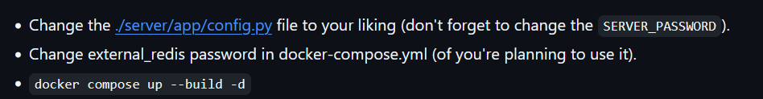

# S4DFarm

This is a fork of [DestructiveFarm](https://github.com/DestructiveVoice/DestructiveFarm), 
rewritten by the C4T BuT S4D team over the years.

## Setup:
           
About [config.py](server/app/config.py):        
- Team config: config the opponent team IP          
    Ex: 10.60.0.3 (Team 1), 10.60.1.3 (Team 2)          

    ```python
    'TEAMS': {
        f'Team #{i}': f'10.60.{i}.3'
        for i in range(0, 10)
    }
    ```
- Flag config: base on the competition         
    `'FLAG_FORMAT': r'[A-Z0-9]{31}='`   
    or  
    `'FLAG_FORMAT' : r'FAUST_[A-Za-z0-9/+]{32}'`    

- System config: base on the competition        
    EX: Faust config        
    ```python
    'SYSTEM_PROTOCOL': 'forcad_tcp',
    'SYSTEM_HOST': 'submission.faustctf.net',
    'SYSTEM_PORT': '666',
    'TEAM_TOKEN': 'your_secret_token', # NEED REPLACE TEAM_TOKEN
    ```

- FLAG_LIFETIME: base on the competition    
    Ex: One tick lasts three minutes in Faust   
    `'FLAG_LIFETIME': 3 * 60`

- SERVER_PASSWORD: need change SERVER_PASSWORD 
    ```python
    'SERVER_PASSWORD': os.getenv('SERVER_PASSWORD') or '@@Pwnsec'
    ```

- Run: `docker compose up --build -d`


## Submit flag
[start_exploit.py](client/start_sploit.py): client/start_exploit.py  

command: 
```bash
python3 start_sploit.py --server-url http://FARM-IP/ --server-pass YOUR_PASS sample_exploit.py
```
Ex: Sample_exploit.py
```python
#!/usr/bin/env python3

import random
import string
import sys

print("Hello! I am a little sploit. I could be written on any language, but "
      "my author loves Python. Look at my source - it is really simple. "
      "I should steal flags and print them on stdout or stderr. ")

host = sys.argv[1]
print("I need to attack a team with host: {}".format(host))

print("Here are some random flags for you:")

for _ in range(3):
    flag = ''.join(random.choice(string.ascii_uppercase + string.digits) for _ in range(31)) + '='
    print(flag, flush=True)
```
- FARM-IP: public IP or hostname (Ex: 127.0.0.1:5137)
- YOUR_PASS: `SERVER_PASSWORD` in config file   

**Note**: Your script must include `#!/usr/bin/env python3` and `print(flag, flush=True)`

